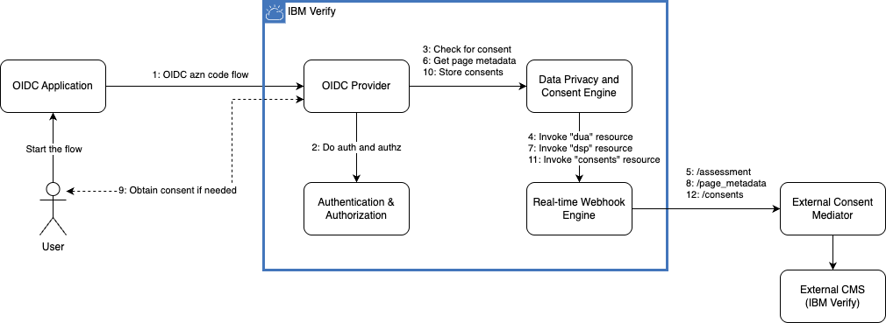

# IBM Verify External Consent Mediator App

The IBM Verify External Consent Mediator App is a Node.js application that serves privacy and consent management endpoints based on the [OpenAPI specification for external consent providers](https://docs.verify.ibm.com/verify/page/api-documentation). It is intended to be a sample external consent management mediator or proxy that uses the [IBM Verify Privacy SDK](https://www.npmjs.com/package/@ibm-verify/privacy) to integrate with a IBM Verify tenant to manage privacy and consent.

An illustration of this implementation is as below.



## Features

- Implementation of six key endpoints:
  - Basic endpoints with in-memory storage:
    - `/v1.0/basic/assessment`: Assess if a user has given consent for specific purposes
    - `/v1.0/basic/page_metadata`: Get metadata for consent presentation
    - `/v1.0/basic/consents`: Store user consents
  - IBM Verify Privacy SDK integration:
    - `/v1.0/verify/assessment`: Assess privacy using IBM Verify
    - `/v1.0/verify/page_metadata`: Get metadata using IBM Verify
    - `/v1.0/verify/consents`: Store consents using IBM Verify
- Request validation
- Error handling
- In-memory storage for basic endpoints (for demonstration purposes)
- IBM Verify Privacy SDK integration for Verify endpoints

## Installation

1. Clone this repository
2. Install dependencies:
   ```
   npm install
   ```
3. Create a `.env` file based on `.env.example` with your IBM Verify credentials:
   ```
   VERIFY_TENANT_URL=https://your-tenant.verify.ibm.com
   VERIFY_CLIENT_ID=your-client-id
   VERIFY_CLIENT_SECRET=your-client-secret
   ```
4. Start the server:
   ```
   node index.js
   ```

The server will start on port 3000 by default. You can change this by setting the `PORT` environment variable.

### Obtaining IBM Verify credentials

Note that the IBM Verify instance configured here serves a dual purpose -

1. As a consent management system and store invoked through the /v1.0/verify/* APIs.
2. As an OAuth server that issues tokens to authorize calls into the /v1.0/verify/* APIs.

In order to obtain an appropriate API client ID and secret, you will need to [create an API Client](https://docs.verify.ibm.com/verify/docs/support-developers-create-api-client) on your IBM Verify tenant. You will need the following entitlements:

- Create privacy consent records (createPrivacyConsent)
- Retrieve privacy purposes and associated user's consent (performDSP)
- Check for data usage approval (performDUA)

## API Endpoints

### Basic Endpoints (In-memory storage)

#### POST /v1.0/basic/assessment

Assess if a user has given consent for specific purposes.

**Request Body:**
```json
{
  "subjectId": "user123",
  "isExternalSubject": false,
  "geoIP": "192.168.1.1",
  "items": [
    {
      "purposeId": "marketing",
      "accessTypeId": "email",
      "attributeId": "email_address"
    }
  ]
}
```

**Response:**
```json
{
  "status": "needs_consent",
  "assessment": [
    {
      "purposeId": "marketing",
      "accessTypeId": "email",
      "attributeId": "email_address",
      "attributeValue": null,
      "result": {
        "approved": false,
        "approvalRequired": true,
        "promptForConsent": true,
        "reason": null
      }
    }
  ]
}
```

#### POST /v1.0/basic/page_metadata

Get metadata for consent presentation.

**Request Body:**
```json
{
  "subjectId": "user123",
  "isExternalSubject": false,
  "geoIP": "192.168.1.1",
  "items": [
    {
      "purposeId": "terms-of-service"
    },
    {
      "purposeId": "marketing",
      "accessTypeId": "email",
      "attributeId": "email_address"
    }
  ]
}
```

#### POST /v1.0/basic/consents

Store user consents.

**Request Body:**
```json
[
  {
    "subjectId": "user123",
    "purposeId": "marketing",
    "accessTypeId": "email",
    "attributeId": "email_address",
    "state": "opt_in",
    "isExternalSubject": false
  }
]
```

### IBM Verify Privacy Endpoints

#### POST /v1.0/verify/assessment

Assess privacy requirements using IBM Verify Privacy SDK.

**Request Body:** Same as basic assessment endpoint

#### POST /v1.0/verify/page_metadata

Get consent presentation metadata using IBM Verify Privacy SDK.

**Request Body:** Same as basic page_metadata endpoint

#### POST /v1.0/verify/consents

Store user consent records using IBM Verify Privacy SDK.

**Request Body:** Same as basic consents endpoint

## IBM Verify Privacy SDK Integration

The `/v1.0/verify/*` endpoints use the IBM Verify Privacy SDK to interact with the IBM Verify service. To use these endpoints, you need to:

1. Have an IBM Verify tenant
2. Configure your tenant URL, client ID, and client secret in the `.env` file
3. Ensure your IBM Verify tenant is properly configured for privacy and consent management

## Configuring as an External Consent Provider on IBM Verify

To use this Node.js application as an external consent provider in IBM Verify, you need to configure webhooks, consent providers, and OIDC applications in your IBM Verify tenant.

For detailed configuration steps, see the [Configuring IBM Verify guide](configuring-verify/README.md).

The configuration process involves:
1. Creating a webhook that points to this application
2. Creating a consent provider that references the webhook
3. Updating your OIDC application to use the consent provider


## Error Handling

The API returns appropriate error responses with status codes and error messages:

- 400: Bad Request (invalid input)
- 500: Internal Server Error

